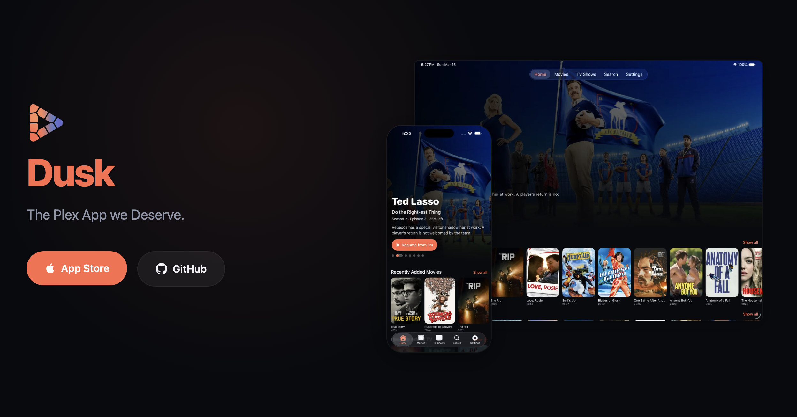

# Dusk for Plex

A native Swift/SwiftUI Plex client for Apple platforms.



> **Warning:** This project is under very active development. Expect bugs and unexpected behavior. If you run into issues, please [submit an issue](https://github.com/marvinvr/dusk-player/issues).

> **Download:**
> [](https://apps.apple.com/us/app/dusk-for-plex/id6760492635)

## Features

- [x] Direct Play
- [x] Library browsing & Search
- [x] Subtitle & audio track selection
- [x] Continuous Playback
- [x] Picture in Picture
- [x] Skip Intro & Credits
- [x] Passout Protection (Are you still watching?)
- [x] macOS App
- [x] Select which version to play
- [x] tvOS App
- [x] App Store Release
- [ ] Offline playback (Downloads)
- [ ] Plex Home Integration

### Later down the line
- [ ] Jellyfin Support
- [ ] Live TV Support
- [ ] Transcoding Support

## Setup

```bash
# 1. Generate the Xcode project if needed
brew install xcodegen  # if not already installed
xcodegen generate

# 2. Open in Xcode
open Dusk.xcodeproj
```

The repository now vendors `Frameworks/VLCKit.xcframework` for iOS/iPadOS and `Frameworks/VLCKit-tvOS.xcframework` for tvOS. To refresh those binaries manually, run:

```bash
./ci_scripts/install_vlckit.sh
```

## License

MIT
